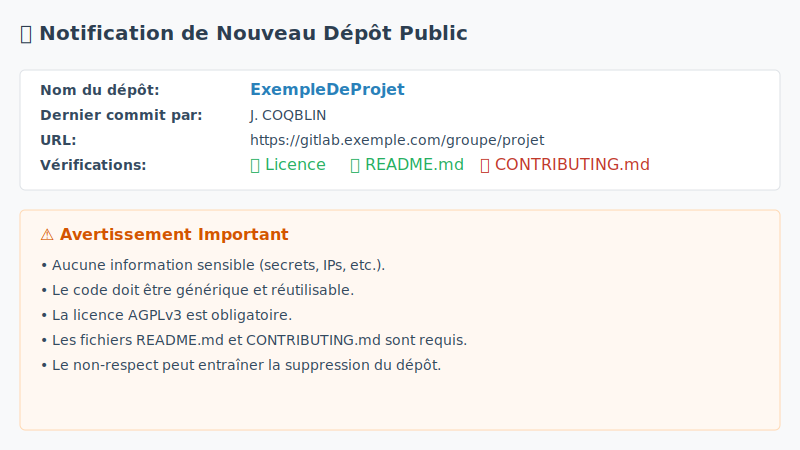
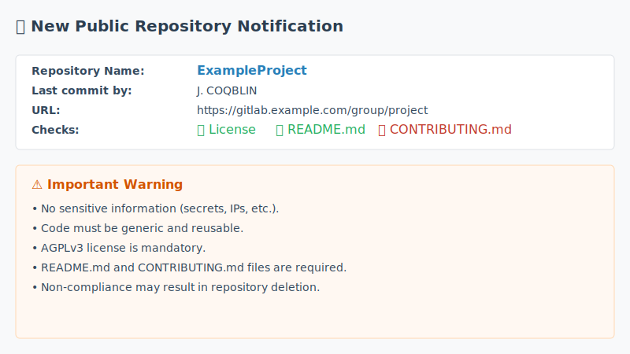

# GitLab Public Repository Monitor

[](https://www.gnu.org/licenses/agpl-3.0)
[](https://www.gnu.org/lang/shell)
[](https://gitlab.villejuif.fr/depots-public/gitlabmonitor/-/releases)

Un script shell robuste qui utilise l'**API officielle de GitLab** pour surveiller l'apparition de nouveaux dépôts publics et envoyer des notifications par email.

**[English version below](#english-version)**

---

## 📋 Fonctionnalités

- **Robuste et fiable** : Utilise l'API JSON officielle de GitLab, éliminant les erreurs liées au scraping HTML.
- **Notification unique** : Envoie un email seulement lors de la première détection d'un dépôt (basé sur son ID).
- **Templates d'email externes** : Le contenu des emails est géré dans des fichiers `template.fr.md` et `template.en.md` faciles à modifier.
- **Deux modes d'envoi d'email** : Utilise `sendmail` (par défaut) ou un serveur **SMTP** externe.
- **Support bilingue** : Messages en français ou anglais.
- **Logging complet** et **Mode test** (`--dry-run`).
- **Notification CC optionnelle** : Peut mettre en copie l'auteur du dernier commit.
- **Sortie améliorée** : Affiche des informations claires sur les dépôts traités, ignorés et les destinataires des emails.

## 🚀 Installation

### 1. Prérequis

- **Shell** : `bash` version 4 ou supérieure.
- **Outils en ligne de commande** : `git`, `curl`, `jq`.
- **Serveur mail** : `sendmail` est requis si vous n'utilisez pas de serveur SMTP externe.

```bash
# Pour Debian/Ubuntu
sudo apt-get update && sudo apt-get install bash git curl jq sendmail

# Pour CentOS/RHEL
sudo yum install bash git curl jq sendmail
```

### 2. Installation

La méthode recommandée est de cloner le dépôt :
```bash
git clone https://gitlab.villejuif.fr/depots-public/gitlabmonitor.git
cd gitlabmonitor
```
Alternativement, vous pouvez télécharger la dernière version directement depuis le registre de paquets :

[](https://gitlab.villejuif.fr/depots-public/gitlabmonitor/-/packages)

L'historique complet des versions est aussi disponible sur la [page des Releases](https://gitlab.villejuif.fr/depots-public/gitlabmonitor/-/releases).

Une fois les fichiers obtenus, rendez le script exécutable :
```bash
chmod +x gitlab-public-repo-monitor.sh
```

### 3. Configuration

Créez votre fichier de configuration personnel à partir de l'exemple fourni (`cp config.conf.example config.conf`) et ajustez les variables suivantes selon vos besoins :

| Variable | Description | Défaut |
|---|---|---|
| `GITLAB_URL` | URL de votre instance GitLab. | `"https://gitlab.example.com"` |
| `NOTIFICATION_LANGUAGE` | Langue des notifications (`FR` ou `EN`). | `"FR"` |
| `EMAIL_TO` | Destinataire principal des alertes. | `"admin@example.com"` |
| `EMAIL_FROM` | Expéditeur des alertes. | `"gitlab-monitor@example.com"` |
| `EMAIL_SUBJECT_FR` / `_EN` | Sujet des emails (utilise `$REPONAME`). | `...` |
| `SMTP_SERVER` | (Optionnel) Serveur SMTP pour l'envoi. | `""` |
| `SMTP_PORT` | (Optionnel) Port du serveur SMTP. | `"25"` |
| `SMTP_USER` | (Optionnel) Utilisateur pour l'authentification SMTP. | `""` |
| `SMTP_PASS` | (Optionnel) Mot de passe pour l'authentification SMTP. | `""` |
| `SMTP_TLS` | (Optionnel) Mettre à `"true"` pour utiliser SMTPS. | `""` |
| `CC_COMMIT_AUTHOR` | Mettre à `true` pour mettre en copie l'auteur du dernier commit. | `false` |
| `API_TIMEOUT` | Timeout en secondes pour les appels API. | `30` |
| `LOG_LEVEL` | Niveau de log (`DEBUG`, `INFO`, `WARN`, `ERROR`). | `"INFO"` |


## 🖥️ Utilisation

### Exécution Manuelle
```bash
# Exécution normale
./gitlab-public-repo-monitor.sh

# Mode test (n'envoie pas d'email et ne met pas à jour le cache)
./gitlab-public-repo-monitor.sh --dry-run
```

### Automatisation (Cron)

Pour exécuter le script automatiquement, vous pouvez ajouter une entrée à votre crontab (`crontab -e`).

**Exemple simple** : Exécution toutes les heures.
```crontab
0 * * * * /chemin/complet/vers/gitlab-public-repo-monitor.sh >> /var/log/gitlab-monitor-cron.log 2>&1
```

**Exemple avancé** : Exécution tous les jours à 7h00, en s'assurant que le script s'exécute depuis son propre répertoire pour une gestion correcte des logs et des fichiers templates.
```crontab
0 7 * * * cd /chemin/complet/vers/gitlab-public-repo-monitor/ && ./gitlab-public-repo-monitor.sh
```

## 📊 Exemple de Notification

#### Version Française


#### Version Anglaise


---

# English Version

A robust shell script that uses the **official GitLab API** to monitor for new public repositories and send email notifications.

## 📋 Features

- **Robust and Reliable**: Uses the official GitLab JSON API, eliminating errors from HTML scraping.
- **Unique Notification**: Sends an email only upon first detection (based on the repository's ID).
- **External Email Templates**: Email content is managed in easy-to-edit `template.fr.md` and `template.en.md` files.
- **Dual Email Sending Modes**: Uses `sendmail` (default) or an external **SMTP** server.
- **Bilingual Support**: Messages in French or English.
- **Complete Logging** and **Dry-run Mode** (`--dry-run`).
- **Optional CC Notification**: Can CC the author of the last commit.
- **Enhanced Output**: Displays clear information about processed, skipped repositories and email recipients.

## 🚀 Installation

### 1. Prerequisites

- **Shell**: `bash` version 4 or higher.
- **Command-line tools**: `git`, `curl`, `jq`.
- **Mail Server**: `sendmail` is required only if you are not using an external SMTP server.

```bash
# For Debian/Ubuntu
sudo apt-get update && sudo apt-get install bash git curl jq sendmail

# For CentOS/RHEL
sudo yum install bash git curl jq sendmail
```

### 2. Installation

The recommended method is to clone the repository:
```bash
git clone https://gitlab.villejuif.fr/depots-public/gitlabmonitor.git
cd gitlabmonitor
```
Alternatively, you can download the latest version directly from the package registry:

[](https://gitlab.villejuif.fr/depots-public/gitlabmonitor/-/packages)

The full release history is also available on the [Releases page](https://gitlab.villejuif.fr/depots-public/gitlabmonitor/-/releases).

Once you have the files, make the script executable:
```bash
chmod +x gitlab-public-repo-monitor.sh
```

### 3. Configuration

Create your personal configuration file from the provided example (`cp config.conf.example config.conf`) and adjust the following variables to your needs:

| Variable | Description | Default |
|---|---|---|
| `GITLAB_URL` | URL of your GitLab instance. | `"https://gitlab.example.com"` |
| `NOTIFICATION_LANGUAGE` | Notification language (`FR` or `EN`). | `"FR"` |
| `EMAIL_TO` | Primary recipient for alerts. | `"admin@example.com"` |
| `EMAIL_FROM` | Sender of the alerts. | `"gitlab-monitor@example.com"` |
| `EMAIL_SUBJECT_FR` / `_EN` | Email subject (uses `$REPONAME`). | `...` |
| `SMTP_SERVER` | (Optional) SMTP server for sending emails. | `""` |
| `SMTP_PORT` | (Optional) SMTP server port. | `"25"` |
| `SMTP_USER` | (Optional) User for SMTP authentication. | `""` |
| `SMTP_PASS` | (Optional) Password for SMTP authentication. | `""` |
| `SMTP_TLS` | (Optional) Set to `"true"` to use SMTPS. | `""` |
| `CC_COMMIT_AUTHOR` | Set to `true` to CC the last commit author. | `false` |
| `API_TIMEOUT` | Timeout in seconds for API calls. | `30` |
| `LOG_LEVEL` | Log level (`DEBUG`, `INFO`, `WARN`, `ERROR`). | `"INFO"` |


## 🖥️ Usage

### Manual Execution
```bash
# Normal execution
./gitlab-public-repo-monitor.sh

# Dry-run mode (does not send emails or update the cache)
./gitlab-public-repo-monitor.sh --dry-run
```

### Automation (Cron)

To run the script automatically, you can add an entry to your crontab (`crontab -e`).

**Simple Example**: Run every hour.
```crontab
0 * * * * /full/path/to/gitlab-public-repo-monitor.sh >> /var/log/gitlab-monitor-cron.log 2>&1
```

**Advanced Example**: Run every day at 7:00 AM, ensuring the script runs from its own directory for proper log and template file handling.
```crontab
0 7 * * * cd /full/path/to/gitlab-public-repo-monitor/ && ./gitlab-public-repo-monitor.sh
```
